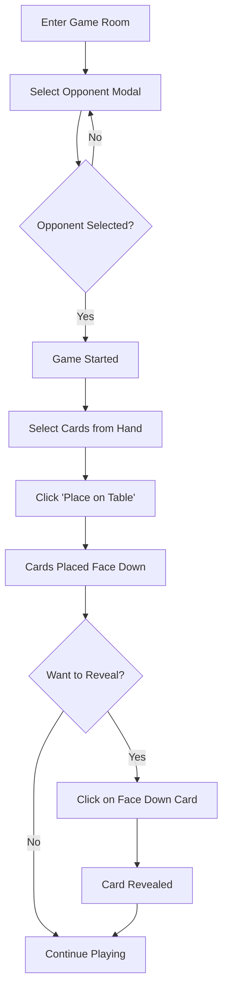

# Game Features Documentation

## 🎮 Card Playing System

### Overview
เกมมีระบบการวางการ์ดบนโต๊ะแบบ real-time โดยผู้เล่นสามารถเลือกฝ่ายตรงข้าม วางการ์ดคว่ำ และเปิดการ์ดทีละใบได้

### Features Implemented

#### 1. **Opponent Selection** 🎯
- เมื่อเข้ามาหน้าเกม จะมี Modal ให้เลือกฝ่ายตรงข้ามที่ต้องการเล่นด้วย
- แสดงข้อมูลผู้เล่น: Avatar, ชื่อ, สถานะ (Human/Infected/Immune)
- เกมจะเริ่มเมื่อเลือกฝ่ายตรงข้ามแล้ว

#### 2. **Card Placement System** 🃏
- **เลือกการ์ด**: คลิกที่การ์ดในมือเพื่อเลือก (สามารถเลือกได้หลายใบ)
- **วางการ์ด**: กดปุ่ม "Place on Table" เพื่อวางการ์ดคว่ำบนโต๊ะ
- **การ์ดคว่ำ**: การ์ดที่วางจะแสดงเป็นการ์ดคว่ำ (🂠) พร้อมไอคอนตา (👁️)

#### 3. **Card Reveal System** 👁️
- **เปิดการ์ด**: คลิกที่การ์ดคว่ำเพื่อเปิดดูเนื้อหา
- **Animation**: มี animation เมื่อเปิดการ์ด
- สามารถเปิดได้ทั้งการ์ดฝั่งตัวเองและฝั่งตรขา้ม

#### 4. **Table Area Layout** 🎲
```
┌─────────────────────────────────┐
│   Opponent's Placed Cards       │
│   (Face down/Face up cards)     │
├─────────────────────────────────┤
│   Deck  🧠    Discard  🧟‍♂️      │
├─────────────────────────────────┤
│   Your Placed Cards             │
│   (Face down/Face up cards)     │
└─────────────────────────────────┘
```

### Game Flow



### Code Structure

#### GameState Interface
```typescript
interface GameState {
    currentPlayer: string;
    players: Player[];
    deckCount: number;
    discardCount: number;
    playerHand: GameCard[];
    isAnimating: boolean;
    gameStarted: boolean;          // ✨ NEW
    selectedOpponent: string | null; // ✨ NEW
    myPlacedCards: PlacedCard[];    // ✨ NEW
    opponentPlacedCards: PlacedCard[]; // ✨ NEW
}
```

#### PlacedCard Interface
```typescript
interface PlacedCard {
    id: string;
    card: GameCard;
    isRevealed: boolean;  // false = face down, true = face up
    playerId: string;
}
```

### Key Functions

| Function | Description |
|----------|-------------|
| `handleSelectOpponent(opponentId)` | เลือกฝ่ายตรงข้ามและเริ่มเกม |
| `handlePlaceCards()` | วางการ์ดที่เลือกบนโต๊ะ (แบบคว่ำ) |
| `handleRevealCard(cardId, isMyCard)` | เปิดการ์ดที่วางบนโต๊ะ |
| `renderPlacedCard(placedCard, isMyCard)` | แสดงการ์ดบนโต๊ะ (คว่ำหรือหงาย) |
| `simulateOpponentPlaceCards()` | จำลองฝ่ายตรงข้ามวางการ์ด (ชั่วคราว) |

### Action Buttons

1. **💉 Use Vaccine** - ใช้การ์ดวัคซีน
2. **🔫 Use Gun** - ใช้การ์ดปืน
3. **Place on Table** - วางการ์ดบนโต๊ะ (คว่ำ)
4. **Play to Discard** - ทิ้งการ์ดลงกองทิ้ง

### Animations

- ✨ **Card Placement**: การ์ดจะมี animation เมื่อวางบนโต๊ะ
- 🔄 **Card Flip**: การ์ดจะมี flip animation เมื่อเปิด
- 💫 **Glow Effect**: การ์ดคว่ำจะมีเอฟเฟกต์เรืองแสง

### Responsive Design

#### Mobile View 📱
- Vertical layout
- Compact card display (50px x 70px)
- Stacked buttons
- Modal เต็มหน้าจอ

#### Desktop View 🖥️
- Horizontal layout
- Larger cards (70px x 100px)
- Row-based button layout
- Centered modal (600px width)

## 🔮 Future Implementation: Socket.IO

### Preparation
ได้เตรียม Socket.IO utility ไว้ที่ `src/lib/socket.ts` แล้ว

### Installation
```bash
npm install socket.io-client
```

### Socket Events (Planned)

#### Client → Server
- `joinRoom` - เข้าห้อง
- `leaveRoom` - ออกจากห้อง
- `placeCards` - วางการ์ด
- `revealCard` - เปิดการ์ด
- `selectOpponent` - เลือกฝ่ายตรงข้าม

#### Server → Client
- `playerJoined` - มีผู้เล่นเข้ามา
- `playerLeft` - มีผู้เล่นออกไป
- `cardPlaced` - ฝ่ายตรงข้ามวางการ์ด
- `cardRevealed` - ฝ่ายตรงข้ามเปิดการ์ด
- `gameStateUpdate` - อัปเดตสถานะเกม

### Implementation Steps

1. **Setup Socket.IO Server**
   ```typescript
   // server.js
   const io = require('socket.io')(server);
   
   io.on('connection', (socket) => {
     socket.on('joinRoom', (data) => { ... });
     socket.on('placeCards', (data) => { ... });
     socket.on('revealCard', (data) => { ... });
   });
   ```

2. **Initialize in Component**
   ```typescript
   useEffect(() => {
     const socket = initSocket('http://localhost:3001');
     
     socket.emit('joinRoom', { 
       roomId, 
       playerId: 'player-id',
       playerName: 'Player Name'
     });
     
     socket.on('cardPlaced', (data) => {
       // Update opponent's placed cards
     });
     
     return () => {
       disconnectSocket();
     };
   }, [roomId]);
   ```

3. **Replace Simulation Code**
   - ลบฟังก์ชัน `simulateOpponentPlaceCards()`
   - เชื่อมต่อกับ Socket.IO events จริง

### Example Usage

```typescript
// When placing cards
handlePlaceCards() {
  // ... existing code ...
  
  // Replace this simulation:
  // setTimeout(() => simulateOpponentPlaceCards(), 2000);
  
  // With real socket emit:
  socket.emit('placeCards', {
    roomId,
    cards: placedCards,
    playerId: currentPlayerId
  });
}

// Listen for opponent's actions
socket.on('cardPlaced', (data) => {
  setGameState(prev => ({
    ...prev,
    opponentPlacedCards: [...prev.opponentPlacedCards, ...data.cards]
  }));
  message.info('Opponent placed cards on the table!');
});
```

## 🎨 Styling

### CSS Classes
- `.card-item` - Base card styling
- `.card-face-down` - Face down card with glow effect
- `.animate-flip` - Card flip animation
- `.animate-place` - Card placement animation

### Theme Colors
- **Face Down Card**: Purple gradient (#667eea → #764ba2)
- **My Cards Area**: Blue overlay (bg-blue-900 bg-opacity-30)
- **Opponent Cards Area**: Gray background (bg-gray-700)

## 📝 Testing

### Manual Test Cases

1. **Opponent Selection**
   - [ ] Modal แสดงเมื่อเข้าเกม
   - [ ] สามารถเลือกฝ่ายตรงข้ามได้
   - [ ] Modal ปิดหลังเลือก
   - [ ] เกมเริ่มหลังเลือก

2. **Card Placement**
   - [ ] เลือกการ์ดได้หลายใบ
   - [ ] กดวางการ์ดได้
   - [ ] การ์ดหายจากมือ
   - [ ] การ์ดปรากฏบนโต๊ะ (คว่ำ)

3. **Card Reveal**
   - [ ] คลิกเปิดการ์ดได้
   - [ ] การ์ดเปลี่ยนจากคว่ำเป็นหงาย
   - [ ] แสดงเนื้อหาการ์ดถูกต้อง

4. **Simulation**
   - [ ] ฝ่ายตรงข้ามวางการ์ดอัตโนมัติ (2 วินาทีหลังเราวาง)
   - [ ] การ์ดฝ่ายตรงข้ามแสดงในพื้นที่ที่ถูกต้อง

## 🚀 Next Steps

1. ✅ **Completed**: Basic card placement and reveal system
2. 🔄 **In Progress**: UI/UX improvements
3. 📋 **Planned**: 
   - Setup Socket.IO server
   - Implement real-time card sync
   - Add turn-based system
   - Add game rules validation
   - Add sound effects
   - Add player chat

## 🐛 Known Issues

- Opponent card placement is currently simulated
- No real-time sync yet (requires Socket.IO)
- No validation for game rules
- No turn management system

## 📚 Related Files

- `/app/game/[id]/page.tsx` - Main game component
- `/app/game/game.css` - Game-specific styles
- `/src/lib/socket.ts` - Socket.IO utility (prepared)
