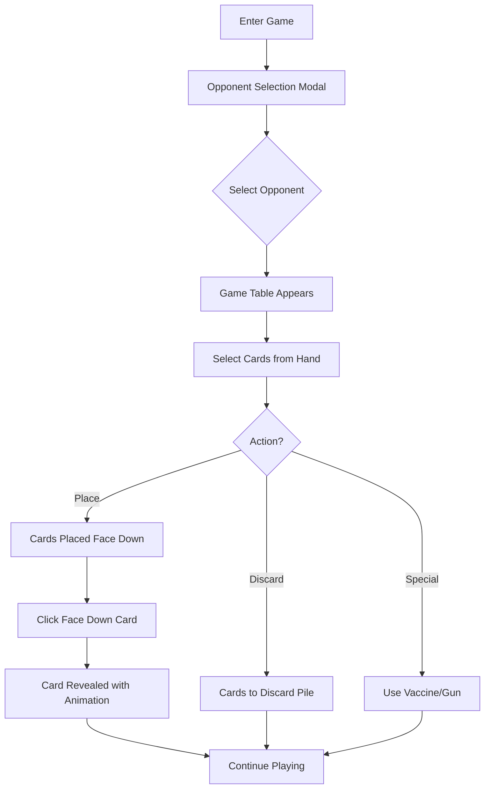

# Game UI Showcase

## 🎮 Game Flow Screenshots

### 1. Opponent Selection (เลือกฝ่ายตรงข้าม)

```
┌─────────────────────────────────────┐
│   Select Your Opponent              │
│                                     │
│  ┌──────────┐    ┌──────────┐     │
│  │   👩      │    │   🧔      │     │
│  │   Bob     │    │  Carol    │     │
│  │   🧟 (I)  │    │   🔫 (H)  │     │
│  └──────────┘    └──────────┘     │
│                                     │
│  Choose who you want to play        │
│  against                            │
└─────────────────────────────────────┘
```

**Features:**
- แสดงรายชื่อผู้เล่นทั้งหมดในห้อง
- แสดง Avatar และสถานะของแต่ละคน
- (I) = Infected, (H) = Human, (Im) = Immune
- Modal จะปรากฏทันทีที่เข้าเกม

---

### 2. Game Table Layout (หน้าจอเกมหลัก)

```
┌────────────────────────────────────────────────────────────┐
│  Room #ABC123 - 🧟 Zombie Game                             │
│  Turn: Alice 🧑 (Human) vs Bob                    [Leave]   │
└────────────────────────────────────────────────────────────┘

┌────────────────────────────────────────────────────────────┐
│  Playing Against: Bob 👩 (Infected 🧟) - 7 cards           │
└────────────────────────────────────────────────────────────┘

┌─────────────────── TABLE AREA ────────────────────────────┐
│                                                            │
│  Opponent's Cards:                                         │
│  ┌──┐ ┌──┐ ┌──┐                                          │
│  │🂠│ │🂠│ │7♥│   ← Face down and revealed cards         │
│  │👁️│ │👁️│ │  │                                          │
│  └──┘ └──┘ └──┘                                          │
│                                                            │
│  ──────────────────────────────────                       │
│                                                            │
│       🧠              🧟‍♂️                                   │
│    Deck [17]       Discard [4]                            │
│                                                            │
│  ──────────────────────────────────                       │
│                                                            │
│  Your Placed Cards:                                        │
│  ┌──┐ ┌──┐ ┌──┐ ┌──┐                                     │
│  │🂠│ │K♠│ │🂠│ │🔫│   ← Your cards                       │
│  │👁️│ │  │ │👁️│ │  │                                     │
│  └──┘ └──┘ └──┘ └──┘                                     │
│                                                            │
└────────────────────────────────────────────────────────────┘

┌─────────────────── YOUR HAND ─────────────────────────────┐
│  ┌──┐ ┌──┐ ┌──┐ ┌──┐ ┌──┐ ┌──┐ ┌──┐                     │
│  │7♥│ │K♠│ │🧟│ │🔫│ │4♦│ │3♥│ │💉│ ...                 │
│  └──┘ └──┘ └──┘ └──┘ └──┘ └──┘ └──┘                     │
│                                                            │
│  Click to select cards (can select multiple)              │
└────────────────────────────────────────────────────────────┘

┌────────────────── ACTION BUTTONS ─────────────────────────┐
│  [💉 Use Vaccine]  [🔫 Use Gun]                           │
│  [Place on Table (3)]  [Play to Discard (3)]             │
└────────────────────────────────────────────────────────────┘
```

---

### 3. Card States (สถานะของการ์ด)

#### A. Card in Hand (การ์ดในมือ)
```
┌─────┐
│  7♥ │  ← Normal state
└─────┘

┌─────┐
│  7♥ │  ← Selected (highlighted, raised)
└─────┘  ✓ Blue border, shadow
```

#### B. Face Down Card (การ์ดคว่ำ)
```
┌─────┐
│  🂠 │  ← Face down with glow effect
│  👁️ │  ← Eye icon = clickable to reveal
└─────┘
     ✨ Glowing animation
```

#### C. Revealed Card (การ์ดที่เปิดแล้ว)
```
┌─────┐
│  7♥ │  ← Revealed card
└─────┘  🔄 Flip animation when revealed
```

---

### 4. Card Types (ประเภทการ์ด)

```
Number Cards:          Special Cards:
┌─────┐               ┌─────┐  ┌─────┐  ┌─────┐
│  7♥ │               │ 🧟  │  │ 🔫  │  │ 💉  │
│ RED │               │ZOMB │  │ GUN │  │VAC  │
└─────┘               └─────┘  └─────┘  └─────┘
                      Zombie   Gun      Vaccine

┌─────┐  ┌─────┐
│  K♠ │  │  A♦ │
│BLACK│  │ RED │
└─────┘  └─────┘
```

---

### 5. Responsive Design

#### Desktop View (1920x1080)
```
┌──────────────────────────────────────────────────────────┐
│                     Wide Layout                          │
│  Header                                         [Leave]  │
│  ─────────────────────────────────────────────────────   │
│                                                           │
│  ┌─────────────────┐  Opponent Info                     │
│  │  Opponent Cards │                                     │
│  └─────────────────┘                                     │
│                                                           │
│  ┌─────────────────┐                                     │
│  │  Deck & Discard │                                     │
│  └─────────────────┘                                     │
│                                                           │
│  ┌─────────────────┐                                     │
│  │   Your Cards    │                                     │
│  └─────────────────┘                                     │
│                                                           │
│  ┌───────────────────────────────────────────────────┐  │
│  │  Your Hand (10+ cards displayed)                  │  │
│  └───────────────────────────────────────────────────┘  │
│                                                           │
│  [Vaccine] [Gun] [Place (3)] [Discard (3)]              │
└──────────────────────────────────────────────────────────┘
```

#### Mobile View (375x667)
```
┌──────────────────┐
│   Compact View   │
│  Header  [Leave] │
│  ──────────────  │
│                  │
│  Opponent: Bob   │
│  ──────────────  │
│                  │
│  Opp Cards:      │
│  🂠 🂠 7♥        │
│                  │
│  🧠    🧟‍♂️       │
│  Deck  Discard   │
│                  │
│  Your Cards:     │
│  🂠 K♠ 🂠 🔫     │
│                  │
│  ──────────────  │
│  Your Hand:      │
│  7♥ K♠ 🧟       │
│  🔫 4♦ 3♥       │
│  💉 A♠ 9♣       │
│                  │
│  [Place (3)]     │
│  [Discard (3)]   │
│  [💉] [🔫]       │
└──────────────────┘
```

---

### 6. Animations

#### Card Placement Animation
```
Step 1: Card in hand
        ↓
Step 2: Card moves up (translateY)
        ↓
Step 3: Card scales and fades
        ↓
Step 4: Card appears on table (face down)
        ↓
Step 5: Glow effect activates

Duration: 0.5s
Effect: ease-out
```

#### Card Flip Animation
```
Step 1: Face down (0deg)
        ↓
Step 2: Rotate to 90deg (invisible)
        ↓
Step 3: Change content
        ↓
Step 4: Rotate from 90deg to 0deg
        ↓
Step 5: Face up revealed

Duration: 0.6s
Effect: ease-in-out
```

---

### 7. Interaction Flow



---

### 8. Color Scheme

```
Background Colors:
  - Main BG: gradient (gray-900 → gray-800)
  - Card Container: gray-800
  - Opponent Area: gray-700
  - Player Area: blue-900 (30% opacity)

Card Colors:
  - Face Down: Purple gradient (#667eea → #764ba2)
  - Red Suits (♥♦): #ff4d4f
  - Black Suits (♠♣): #000000
  - Special Cards: Various (zombie=red, gun=orange, vaccine=blue)

Accent Colors:
  - Selected: Blue (#1890ff)
  - Infected: Red (#ff4d4f)
  - Human: Green
  - Immune: Blue

Shadows:
  - Normal: 0 2px 8px rgba(0, 0, 0, 0.15)
  - Hover: 0 4px 16px rgba(0, 0, 0, 0.25)
  - Selected: 0 8px 25px rgba(24, 144, 255, 0.4)
```

---

### 9. User Experience Features

✅ **Visual Feedback**
- Selected cards raise up and show blue border
- Hover effects on all clickable elements
- Loading states with spinner
- Disabled states for invalid actions

✅ **Notifications**
- Success: "Card revealed!"
- Info: "Opponent placed cards on the table!"
- Warning: "Please select at least one card"
- Error messages for invalid actions

✅ **Responsive**
- Works on desktop (1920x1080)
- Works on tablet (768x1024)
- Works on mobile (375x667)

✅ **Accessibility**
- Large touch targets (44px minimum)
- Clear visual hierarchy
- High contrast text
- Keyboard navigation support

---

### 10. Future UI Enhancements

🔮 **Planned Features**
- [ ] Card drag-and-drop
- [ ] Sound effects
- [ ] Particle effects on card reveal
- [ ] Avatar animations
- [ ] Chat interface
- [ ] Game history panel
- [ ] Spectator mode UI
- [ ] Tournament bracket view
